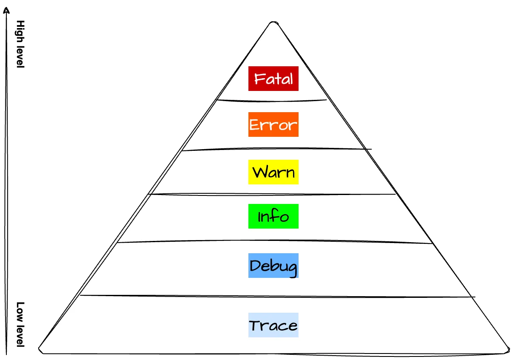

# 12-Factor App Workshop (Angular + Express)

This workshop demonstrates the **12-Factor App principles**
using a real **Angular + Express** application.

⏱ Duration: **10–15 minutes**  
🎯 Target: **Full-stack Developers & DevOps**

---

## Prerequisites

Before you begin, ensure you have the following software installed on your system:

```bash
#This workshop is based on the following software versions
Docker            : 28.3.2
Docker Desktop    : 4.55.0
Angular CLI       : 21.1.0
Angular           : 21.1.0
Node.js           : 24.13.0
Package Manager   : npm 11.6.2
Makefile          : Make 3.82.90

#Options for easy development
MongoCompass      : 1.48.2
```

---

## 12 app Factor

- [Factor 1. Codebase](#factor-1-codebase) _"One codebase tracked in revision control, many deploys"_
- [Factor 2. Dependencies](#factor-2-dependencies) _"Explicitly declare and isolate dependencies"_
- [Factor 3. Config](#factor-3-config) _"Store config in the environment"_
- [Factor 4. Backing service](#factor-4-backing-service) _"Treat backing services as attached resources"_
- [Factor 5. Build, Release, Run](#factor-5-build-release-run) _"Strictly separate build and run stages"_
- [Factor 6. Process ](#factor-6-process) _"Execute the app as one or more stateless processes"_
- [Factor 7. Port Binding](#factor-7-port-binding) _"Export services via port binding"_
- [Factor 8. Concurrency](#factor-8-concurrency) _"Scale out via the process model"_
- [Factor 9. Disposability](#factor-9-disposability) _"Maximize robustness with fast startup and graceful shutdown"_
- [Factor 10. Dev/Prod parity](#factor-10-devprod-parity) _"Keep development, staging, and production as similar as possible"_
- [Factor 11. Logs](#factor-11-logs) _"Treat logs as event streams"_
- [Factor 12. Admin Processes](#factor-12-admin-processes) _"Run admin/management tasks as one-off processes"_

---

## Repository

FrontEND : https://github.com/phongphat-myorder/RVE-frontend-repo

BackEND : https://github.com/phongphat-myorder/RVE-backend-repo

---

## Factor 1. Codebase

_"One codebase tracked in revision control, many deploys"_

Use Git and Github to version control the codebase

`note:This project uses a Makefile to manage and execute scripts.`

```bash
git clone git@github.com:phongphat-myorder/12factor-angular-express-workshop.git
```

then clone frontend and backend by make command

```bash
cd 12factor-angular-express-workshop
make start
```

**[⬆ Back to top](#12-app-factor)**

## Factor 2. Dependencies

_"Explicitly declare and isolate dependencies"_

This project uses a Node Package Manager ( `npm` ) to manage package and package-lock

```bash
make npm-install #auto command install frontend and backend
```

**[⬆ Back to top](#12-app-factor)**

## Factor 3. Config

_"Store config in the environment"_

When deploying to different environments, it is necessary to create configuration files that are appropriate for each environment. We recommend using [GitHub Secrets](https://docs.github.com/en/actions/how-tos/write-workflows/choose-what-workflows-do/use-secrets), which provide a secure way to store sensitive information such as API keys, tokens, credentials, and passwords within your GitHub repositories, organizations, or environments.

In the workshop, the `RVE-backend-repo` is still missing environment-specific `.env` files. Please create these files in the project `root` directory.

`.env`

```bash
APP_ENV=Local
PORT=8080
EMAIL_USER=YourEmail@gmail.com   #your Google email
EMAIL_PASS=YourEmailPassword     #use google app password for security
MONGO_URL=mongodb://localhost:27017/workshop_db
REDIS_URL=redis://localhost:6379
PINO_LOG_LEVEL=debug
```

`.env.dev`

```bash
APP_ENV=Develop
PORT=8080
EMAIL_USER=YourEmail@gmail.com   #your Google email
EMAIL_PASS=YourEmailPassword     #use google app password for security
MONGO_URL=mongodb://mongodb:27017/workshop_db  # Use mongodb not localhost!!
REDIS_URL=redis://redis:6379 # Use redis not localhost!!
PINO_LOG_LEVEL=debug
```

google app password: *https://myaccount.google.com/apppasswords*

After creating the `.env` files,
the backend must validate that it is running in the correct environment (`config.ts`). If the required environment variables are not properly set, the application should fail fast by logging an error and shutting down gracefully.

`./src/config/config.ts`

```typescript
import dotdev from "dotenv";
import path from "node:path";

dotdev.config({ path: path.resolve(__dirname, "../../.env") }); // local .env file

const REQUIRED_ENVS = [
  "APP_ENV",
  "PORT",
  "EMAIL_USER",
  "EMAIL_PASS",
  "MONGO_URL",
  "REDIS_URL",
  "PINO_LOG_LEVEL",
] as const;

export function validateConfig() {
  for (const key of REQUIRED_ENVS) {
    if (!process.env[key]) {
      console.error(`❌ Missing required env: ${key}`);
      process.exit(1);
    }
  }
}

export const config = {
  APP_ENV: process.env.APP_ENV! as string,
  PORT: Number(process.env.PORT!),
  EMAIL_USER: process.env.EMAIL_USER! as string,
  EMAIL_PASS: process.env.EMAIL_PASS! as string,
  MONGO_URL: process.env.MONGO_URL! as string,
  REDIS_URL: process.env.REDIS_URL! as string,
  PINO_LOG_LEVEL: process.env.PINO_LOG_LEVEL! as string,
};
```

At `RVE-front-repo` is still missing environment-specific `.env` files too. Please create these files in the project `root` directory.

`.env`

```bash
MY_ENV=Local #your environment name
NG_APP_API_URL=http://localhost:8080 #your backend URL
```

However,I've already created a `config.js` file and run it in npm `package.json`.

```json
{
 "scripts": {
  ...
  "start": "node config.js && ng serve",
  "build": "node config.js && ng build"
 }
}
```

**[⬆ Back to top](#12-app-factor)**

## Factor 4. Backing service

_"Treat backing services as attached resources"_

A backing service is any service the app consumes over the network as part of its normal operation. Examples datastores, SMTP services, messaging/queueing systems

This `RVE-backend-repo` does not include Redis and MongoDB services for production; they are only included for local testing.

`docker-compose.yml`

```yml
services:
  backend:
    build:
      context: .
      dockerfile: Dockerfile
      args:
        APP_ENV: ${APP_ENV}
        PORT: ${PORT}
        EMAIL_USER: ${EMAIL_USER}
        EMAIL_PASS: ${EMAIL_PASS}
        MONGO_URL: ${MONGO_URL}
        REDIS_URL: ${REDIS_URL}
    image: rve-backend
    env_file:
      - .env.dev
    ports:
      - "8080:8080"
    depends_on:
      - mongodb
      - redis

  redis:
    image: redis:7.0
    restart: always
    ports:
      - "6379:6379"
    volumes:
      - redis:/data

  mongodb:
    build:
      context: ./test/mongo
      dockerfile: Dockerfile
    image: mongo:8.0
    ports:
      - "27017:27017"
    volumes:
      - mongodata:/data/db
volumes:
  redis:
    driver: local
  mongodata:
    driver: local
```

> This part is `Redis` service

```yml
cache:
  image: redis
  restart: always
  ports:
    - "6379:6379"
  command: redis-server --save 20 1 --loglevel warning --requirepass eYVX7EwVmmxKPCDmwMtyKVge8oLd2t81
  volumes:
    - cache:/data
volumes:
  cache:
    driver: local
```

> This part is `mongoDB` service

```yml
mongodb:
  image: mongo:latest
  ports:
    - "27017:27017"
  volumes:
    - mongo-data:/data/db
```

In local development, MongoDB and Redis run as Docker containers.
In production, they are external managed services.
The application treats them the same way—via environment variables.

**[⬆ Back to top](#12-app-factor)**

## Factor 5. Build, Release, Run

_"Strictly separate build and run stages"_

The workshop uses `Makefile` commands to structure the workflow, enabling participants to run each step even with incomplete code.

ิ- build

```bash
make build #Build font-back
make build-back  #Build express backend
make build-front #Build angular frontend
```

- Run

```bash
make run-front
make run-back
```

- Docker compose

```bash
make build-compose #Build docker compose font-back and service
make build-compose-front #Build docker compose only frontend and service
make build-compose-back #Build docker compose only backend and service
```

You can search for other commands that I have been created.

- help

```bash
make help
```

**[⬆ Back to top](#12-app-factor)**

## Factor 6. Process

_"Execute the app as one or more stateless processes"_

Previously, in `email.route.ts`, the application was incorrectly using `in-memory cache` to store response data. This approach violates Factor 6 because data stored in memory is tied to a single process and will be lost when the process restarts or when the application is scaled horizontally.

To align with the `stateless process` principle, the cache must be moved to a `backing service.` Therefore, a `Redis service` has been added and will now be used as the centralized cache store.

1. Add the following import to `email.route.ts`:

```typescript
import { getCache, setCache, deleteCache } from "../redis/workshop_db.cache";
```

2. At `/getRes` replace the code at the line commented as `// <---- process get response`
   with the following implementation:

```typescript
try {
  const cacheData = await getCache("workshopResponses");
  if (cacheData) {
    return res.status(200).json({ cacheMessage: JSON.parse(cacheData) });
  }
  const dataFromDB = await WorkshopRepo.getAllData();
  const formattedData: resultData[] = dataFromDB.map((item) => ({
    status: item.result,
    sender: item.sender,
    timestamp: item.created_at.toISOString(),
  }));
  await setCache("workshopResponses", formattedData);
  return res.status(200).json({ formattedData });
} catch (error) {
  console.error("Error fetching responses:", error);
  return res.status(500).json({ message: "Internal Server Error" });
}
```

3.At `/deleteRes` Replace the code at the line commented as `// <---- process Delete response`
with the following line:

```typescript
await deleteCache("workshopResponses");
```

**[⬆ Back to top](#12-app-factor)**

## Factor 7. Port Binding

_"Export services via port binding"_

The `docker-compose.yml` file clearly defines the port, helping us understand how the application is exposed and accessed.Please fill in the port number in the blank.

```bash
Frontend  port ...
Backend   port ...
redis     port ...
mongodb   port ...
```

**[⬆ Back to top](#12-app-factor)**

## Factor 8. Concurrency

_"Scale out via the process model"_

This factor states that applications should scale by running multiple instances of the same process, rather than by increasing the size or complexity of a single process.

In a 12-Factor App, concurrency is achieved by replicating stateless processes, not by adding threads or shared in-memory state.

`RVE-backend-repo/docker-compose.yml`

```yml
backend:
  build:
    context: .
    dockerfile: Dockerfile
    args:
      APP_ENV: ${APP_ENV}
      PORT: ${PORT}
      EMAIL_USER: ${EMAIL_USER}
      EMAIL_PASS: ${EMAIL_PASS}
      MONGO_URL: ${MONGO_URL}
      REDIS_URL: ${REDIS_URL}
  image: rve-backend
  deploy:
    mode: replicated
    replicas: 5
  env_file:
    - .env.dev
  ports:
    - "8080:8080"
  depends_on:
    - mongodb
    - redis
```

**[⬆ Back to top](#12-app-factor)**

## Factor 9. Disposability

_"Maximize robustness with fast startup and graceful shutdown"_

At `index.ts` replace the code at the line commented as `// <---- disposability graceful shutdown`
with the following implementation:

```typescript
async function gracefulShutdown(signal: string) {
  console.log(`🛑 ${signal} received. Shutting down gracefully...`);

  server.close(async () => {
    console.log("📴 HTTP server closed");

    await closeRedis();
    await closeDB();

    console.log("✅ Graceful shutdown completed");
    process.exit(0);
  });

  setTimeout(() => {
    console.error("⏱️ Force shutdown");
    process.exit(1);
  }, 10000);
}

process.on("SIGTERM", gracefulShutdown);
process.on("SIGINT", gracefulShutdown);
```

**[⬆ Back to top](#12-app-factor)**

## Factor 10. Dev/Prod parity

_"Keep development, staging, and production as similar as possible"_

This practice focuses on cleaning and `standardizing the codebase` to ensure consistency across all parts of the application. When similar logic is implemented differently in multiple places, it increases maintenance complexity and makes future bug fixes more difficult.

In this workshop Frontend and backend follows a structured branching strategy on GitHub:

1. A develop branch is used for ongoing development.

2. A master branch represents stable, production-ready code.

3. Changes are merged into develop and then promoted to master within no more than one day (or week).

**[⬆ Back to top](#12-app-factor)**

## Factor 11. Logs

_"Treat logs as event streams"_

**Please include sample logs in the `RVE-backend-repo`.**

Log level: Low ---> Hight Level

### Trace

- Used to record every `fine-grained operation`, down to `line-level execution`, such as `function calls`, `call origins`, and `internal steps`.
  intended use: development and testing **not be enabled in production.**

```typescript
logger.trace({ message }, "Send email endpoint called with message:");
```

### Debug

- Logs internal information such as `parameter values`, `configuration data`, and `object states` to help developers understand application behavior.
  intended use: development and testing **not be enabled in production.**

```typescript
logger.debug({ APP_ENV: config.APP_ENV }, "App environment");
```

### Info

- Used to log normal and expected `application events`. Examples include `service startup`, `successful external API calls`, or important `business flow` milestones.
  intended use: track the general behavior of the system in production.

```typescript
logger.Info("sent massage success");
```

### Warn

- Used to log abnormal or `unexpected situations` that do not stop the system from working.Examples include failed login attempts, deprecated API usage, or jobs that initially failed but succeeded after retrying.

### Error

- Logged when an error occurs that causes a specific operation to fail, but the service itself can continue running. Examples include external API failures or database query errors.

```typescript
logger.error({ error }, "Error sending email");
```

### Fatal

- Used for critical errors that prevent the process from continuing. The service cannot recover and must shut down or restart.

```typescript
logger.fatal({ error }, "❌ MongoDB connection error:");
```

```typescript
logger.fatal({ error }, "❌ Error closing Redis connection:");
```



**[⬆ Back to top](#12-app-factor)**

## Factor 12. Admin Processes

_"Run admin/management tasks as one-off processes"_

This workshop using a Makefile to manage all administrative and operational tasks.

Makefile

```bash
make start
make npm-install
make build
make build-front
make build-back
make build-compose
make build-compose-back
make build-compose-front
make run-front
make run-back
make down
```

These commands are not part of the long-running web process.
They are executed only when needed and terminate immediately after finishing their task.

**[⬆ Back to top](#12-app-factor)**
